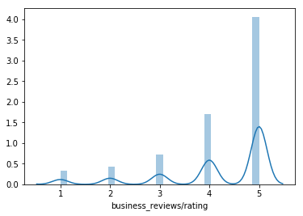
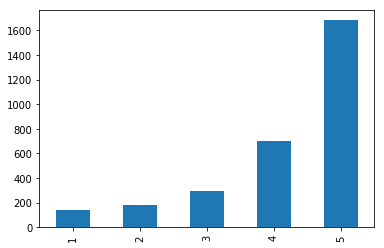
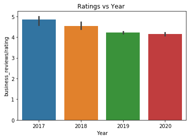
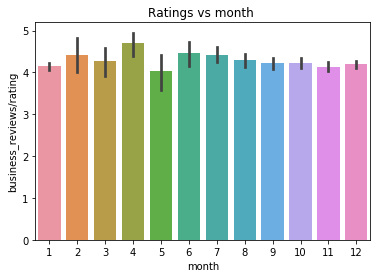
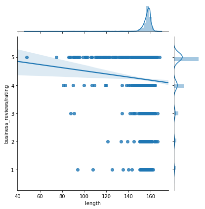
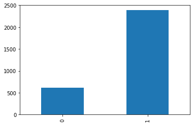
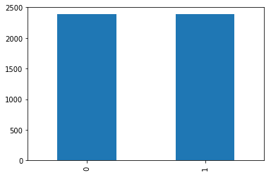
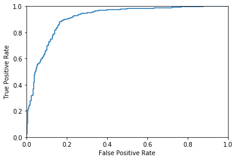

# CS410/510 Yelp Data Analysis
By Team Portland Foodies (Qiacheng Li and Yiming Zhang)
<br>

Project website:
[https://portlandfoodies.github.io](https://portlandfoodies.github.io)

Project repo:
https://github.com/portlandfoodies/portlandfoodies.github.io

Website repo:
https://github.com/portlandfoodies/yelp-data-analysis

Scripts used for Yelp Fusion API:
https://github.com/portlandfoodies/portlandfoodies.github.io/tree/master/scripts


## Goals and Description
<br>
Yelp is currently the most widely used restaurant and merchant information software application not only in the United States but also in many other regions of the world. In this project, our team explored and communicated insights from Yelp's businesses, users, reviews dataset of Portland restaurants and learned how to properly develop and structure a visualization and machine learning project. The goal of this project is to provide market knowledge for new business owners in Portland and useful information of selecting restaurants for first time travelers in Portland.
<br>
<br>
We originally planned to use the dataset from Yelp data challenge. However, after we did some exploration of the dataset, we found there are no data records for restaurants in Portland. We adjusted our plan and fetched data from Yelp’s Fusion API. The dataset format is JSON files and we proprocess and convert them into csv for machine learning part of the project.


## Restaurant Categories in Portland, OR


The chart above shows restaurant categories in portland. The area that is bigger means there are more restaurants with this specific category. The purpose of this graph is to show customers which categories of restaurants are most popular in Portland. The intended audience would be first time travelers to Portland or any customers.


<br>
<br>

## Restaurant Categories in Portland, OR


Another categories graph generated by Tableau, it also gives a count number for each category. As we can see here, Portlanders love to have breakfast & Bruch and Bars are most likely the go-to place at night.


<br>
<br>


## Word Cloud for reviews of all restaurants in Portland, OR


The chart above is generated with cleaned review count dataset. As we could see there are still more cleaning needed to be finished. but it's also interesting to see people are mentioning Portland a lot in their reviews

<br>
<br>


## McDonald's, Burger King, and Burgerville Locations in Portland, OR


Based on the chart above, we can see that the fastfood restaurants are located in mostly SE portland.  


<br>
<br>


## Average Rating for McDonald's, Burger King, and Burgerville


By using Tableau, we were able to get the average ratings for these three fastfood restaurants in Portland. Burgerville has an average of 2.8 while McDonald's and Burger King both have an average rating of 1.8.  

<br>
<br>


## Part I User Review General Analysis

### Load The Dataset


```python
import pandas as pd
import numpy as np
import seaborn as sb
import matplotlib.pyplot as plt
%matplotlib inline
#import json
import nltk
from nltk.tokenize import RegexpTokenizer
from nltk.stem import WordNetLemmatizer
from nltk.corpus import stopwords
from nltk.stem import SnowballStemmer
from collections import Counter
from sklearn.model_selection import train_test_split
from keras.preprocessing.text import Tokenizer
from keras.preprocessing.sequence import pad_sequences
from keras import Sequential
from keras.layers import Embedding, Dense, LSTM, LeakyReLU
from keras.models import load_model
```

    Using TensorFlow backend.
    


```python
df = pd.read_csv('reviews.csv')
df.head()
```


<div>
<style scoped>
    .dataframe tbody tr th:only-of-type {
        vertical-align: middle;
    }

    .dataframe tbody tr th {
        vertical-align: top;
    }

    .dataframe thead th {
        text-align: right;
    }
</style>
<table border="1" class="dataframe">
  <thead>
    <tr style="text-align: right;">
      <th></th>
      <th>business_reviews/id</th>
      <th>business_reviews/url</th>
      <th>business_reviews/text</th>
      <th>business_reviews/rating</th>
      <th>business_reviews/time_created</th>
      <th>business_reviews/user/id</th>
      <th>business_reviews/user/profile_url</th>
      <th>business_reviews/user/image_url</th>
      <th>business_reviews/user/name</th>
    </tr>
  </thead>
  <tbody>
    <tr>
      <th>0</th>
      <td>3mnwZLSvbpz3gfov7F2b0g</td>
      <td>https://www.yelp.com/biz/voodoo-doughnut-old-t...</td>
      <td>Yes to donuts always but this place does it ri...</td>
      <td>5</td>
      <td>2020-01-13 17:30:05</td>
      <td>hmUTJKOaB0vI19IRNxELjg</td>
      <td>https://www.yelp.com/user_details?userid=hmUTJ...</td>
      <td>https://s3-media2.fl.yelpcdn.com/photo/rDcrY8r...</td>
      <td>Katie M.</td>
    </tr>
    <tr>
      <th>1</th>
      <td>5SZlakMNk_s-uxEjmO4flA</td>
      <td>https://www.yelp.com/biz/voodoo-doughnut-old-t...</td>
      <td>Yum!!!! My husband and I stopped here on our w...</td>
      <td>5</td>
      <td>2020-01-11 10:10:00</td>
      <td>46Xncm_G1X0mi-_CLbccNw</td>
      <td>https://www.yelp.com/user_details?userid=46Xnc...</td>
      <td>https://s3-media1.fl.yelpcdn.com/photo/VMJdgt8...</td>
      <td>Kristin A.</td>
    </tr>
    <tr>
      <th>2</th>
      <td>aWckloq3kFOWotKJThrM0Q</td>
      <td>https://www.yelp.com/biz/voodoo-doughnut-old-t...</td>
      <td>Fresh and creative as usual. Stop by every tim...</td>
      <td>5</td>
      <td>2020-01-03 20:10:59</td>
      <td>xwct13wtcyasNAIK7C05iA</td>
      <td>https://www.yelp.com/user_details?userid=xwct1...</td>
      <td>https://s3-media1.fl.yelpcdn.com/photo/SzQ4JMO...</td>
      <td>Susana C.</td>
    </tr>
    <tr>
      <th>3</th>
      <td>DJ_sm3nbGroAS3-EQ1m23g</td>
      <td>https://www.yelp.com/biz/screen-door-portland?...</td>
      <td>Where do I start this place is AmAzing. Walked...</td>
      <td>5</td>
      <td>2020-01-23 09:39:59</td>
      <td>0arUBKiSonO9o2W1PGsvNA</td>
      <td>https://www.yelp.com/user_details?userid=0arUB...</td>
      <td>https://s3-media2.fl.yelpcdn.com/photo/M6KmiNC...</td>
      <td>Food T.</td>
    </tr>
    <tr>
      <th>4</th>
      <td>RSOy6Xv9Ch3ETyVvsTERbw</td>
      <td>https://www.yelp.com/biz/screen-door-portland?...</td>
      <td>Expect a 45 minute wait. Two benches inside in...</td>
      <td>4</td>
      <td>2020-01-12 09:57:21</td>
      <td>kWFd_18oJVyJ0aNOAwwRew</td>
      <td>https://www.yelp.com/user_details?userid=kWFd_...</td>
      <td>https://s3-media2.fl.yelpcdn.com/photo/MnRFFH4...</td>
      <td>Joshua F.</td>
    </tr>
  </tbody>
</table>
</div>


```python
df.describe()
```


<div>
<style scoped>
    .dataframe tbody tr th:only-of-type {
        vertical-align: middle;
    }

    .dataframe tbody tr th {
        vertical-align: top;
    }

    .dataframe thead th {
        text-align: right;
    }
</style>
<table border="1" class="dataframe">
  <thead>
    <tr style="text-align: right;">
      <th></th>
      <th>business_reviews/rating</th>
    </tr>
  </thead>
  <tbody>
    <tr>
      <th>count</th>
      <td>3000.000000</td>
    </tr>
    <tr>
      <th>mean</th>
      <td>4.201667</td>
    </tr>
    <tr>
      <th>std</th>
      <td>1.130821</td>
    </tr>
    <tr>
      <th>min</th>
      <td>1.000000</td>
    </tr>
    <tr>
      <th>25%</th>
      <td>4.000000</td>
    </tr>
    <tr>
      <th>50%</th>
      <td>5.000000</td>
    </tr>
    <tr>
      <th>75%</th>
      <td>5.000000</td>
    </tr>
    <tr>
      <th>max</th>
      <td>5.000000</td>
    </tr>
  </tbody>
</table>
</div>


```python
df.info()
```

    <class 'pandas.core.frame.DataFrame'>
    RangeIndex: 3000 entries, 0 to 2999
    Data columns (total 9 columns):
    business_reviews/id                  3000 non-null object
    business_reviews/url                 3000 non-null object
    business_reviews/text                3000 non-null object
    business_reviews/rating              3000 non-null int64
    business_reviews/time_created        3000 non-null object
    business_reviews/user/id             3000 non-null object
    business_reviews/user/profile_url    3000 non-null object
    business_reviews/user/image_url      2942 non-null object
    business_reviews/user/name           3000 non-null object
    dtypes: int64(1), object(8)
    memory usage: 211.1+ KB
    

### Plot The Dataset


```python
sb.distplot(df['business_reviews/rating'])
```


    <matplotlib.axes._subplots.AxesSubplot at 0x2ad2ab80048>





### Rating Distribution


```python
df["business_reviews/rating"].value_counts()
```


    5    1680
    4     705
    3     296
    2     178
    1     141
    Name: business_reviews/rating, dtype: int64


```python
star_count = df["business_reviews/rating"].value_counts()
star_count.reindex([1, 2, 3, 4, 5]).plot.bar()
```


    <matplotlib.axes._subplots.AxesSubplot at 0x2ad2af41080>





Most users give 5 stars.

### Rating vs Year & Rating vs Month


```python
df["date"]= pd.to_datetime(df["business_reviews/time_created"]).dt.date
df.set_index('date').head(1)
df["Year"] = pd.to_datetime(df["business_reviews/time_created"]).dt.year
sb.barplot(x=df["Year"], y=df["business_reviews/rating"], data=df)
plt.title("Ratings vs Year ")
```


    Text(0.5, 1.0, 'Ratings vs Year ')





```python
df["date"]= pd.to_datetime(df["business_reviews/time_created"]).dt.date
df.set_index('date').head(1)
df["month"] = pd.to_datetime(df["business_reviews/time_created"]).dt.month
sb.barplot(x=df["month"], y=df["business_reviews/rating"], data=df)
plt.title("Ratings vs month ")
```


    Text(0.5, 1.0, 'Ratings vs month ')





### Do low rating reviews tend to be longer in text?


```python
df["length"] = df["business_reviews/text"].apply(len)
sb.jointplot(x=df["length"],
              y=df["business_reviews/rating"],
              data=df, kind='reg')
```


    <seaborn.axisgrid.JointGrid at 0x2ad2b12dba8>





The rating is decreasing as the text length increases.

## Part II Machine Learning for Sentiment Analysis

### Goals

Each Portland restaurant in the dataset is rated by user reviews. By understanding the reviews and there positive/negative judgment, businesses can improve their performance to meet the expectation of customers.

### Preprocessing Dataset


```python
df = pd.read_csv('reviews.csv')
df = df[['business_reviews/rating', 'business_reviews/text']]
df.rename(columns = {'business_reviews/rating': 'stars', 'business_reviews/text': 'text'}, inplace = True)
df.head()
```


<div>
<style scoped>
    .dataframe tbody tr th:only-of-type {
        vertical-align: middle;
    }

    .dataframe tbody tr th {
        vertical-align: top;
    }

    .dataframe thead th {
        text-align: right;
    }
</style>
<table border="1" class="dataframe">
  <thead>
    <tr style="text-align: right;">
      <th></th>
      <th>stars</th>
      <th>text</th>
    </tr>
  </thead>
  <tbody>
    <tr>
      <th>0</th>
      <td>5</td>
      <td>Yes to donuts always but this place does it ri...</td>
    </tr>
    <tr>
      <th>1</th>
      <td>5</td>
      <td>Yum!!!! My husband and I stopped here on our w...</td>
    </tr>
    <tr>
      <th>2</th>
      <td>5</td>
      <td>Fresh and creative as usual. Stop by every tim...</td>
    </tr>
    <tr>
      <th>3</th>
      <td>5</td>
      <td>Where do I start this place is AmAzing. Walked...</td>
    </tr>
    <tr>
      <th>4</th>
      <td>4</td>
      <td>Expect a 45 minute wait. Two benches inside in...</td>
    </tr>
  </tbody>
</table>
</div>


```python
# Lowercase all words in the reviews
df['processed_text'] = df['text'].str.lower()
```


```python
# Tokenize the reviews
# Simultaneously the punctation is removed
tokenize = RegexpTokenizer('\w+')
df['processed_text'] = df['processed_text'].apply(lambda review : tokenize.tokenize(review))
```


```python
# Remove stopwords for the reviews
stoplist = stopwords.words('english')
df['processed_text'] = df['processed_text'].apply(lambda review: ' '.join([word for word in review if word not in stoplist]))
```


```python
df['processed_text'].head()
```


    0    yes donuts always place right light fluffy air...
    1    yum husband stopped way back san diego washing...
    2    fresh creative usual stop every time town cali...
    3    start place amazing walked late tuesday mornin...
    4    expect 45 minute wait two benches inside case ...
    Name: processed_text, dtype: object


```python
# Stemming the words in the reviews
stemmer = SnowballStemmer('english')
df['processed_text'] = df['processed_text'].apply(lambda review: ' '.join([stemmer.stem(word) for word in review.split()]))
```


```python
print('The max length of words in a review before preprocessing:', max(df['text'].agg(len)))
print('The max length of words in a review after preprocessing:', max(df['processed_text'].agg(len)))
```

    The max length of words in a review before preprocessing: 168
    The max length of words in a review after preprocessing: 126
    

### Analyse The Reviews

### Most Common Words For High Rating Reviews


```python
counter_words = Counter(" ".join(df.loc[df['stars'] == 5]['processed_text']).split())
counter_words.most_common(10)
```


    [('place', 537),
     ('food', 445),
     ('portland', 304),
     ('great', 304),
     ('love', 263),
     ('good', 254),
     ('time', 209),
     ('best', 195),
     ('friend', 192),
     ('one', 184)]


### Most Common Words For Low Rating Reviews


```python
counter_words = Counter(" ".join(df.loc[df['stars'] == 1]['processed_text']).split())
counter_words.most_common(10)
```


    [('food', 36),
     ('place', 34),
     ('servic', 28),
     ('order', 28),
     ('time', 28),
     ('review', 20),
     ('good', 19),
     ('go', 18),
     ('one', 17),
     ('experi', 17)]


```python
# Total different words
counter_words = Counter(" ".join(df['processed_text']).split())
print('Number of different words in the review:', len(counter_words.most_common()))
```

    Number of different words in the review: 5007
    


```python
# Distribution of the number of words in a review
reviews_len = [len(x) for x in df['processed_text']]
pd.Series(reviews_len).hist()
plt.title('Distribution of words')
plt.show()
pd.Series(reviews_len).describe()
```


    count    3000.000000
    mean       85.245667
    std        11.892314
    min        30.000000
    25%        78.000000
    50%        85.000000
    75%        93.000000
    max       126.000000
    dtype: float64


### Relabel The Rating


```python
# The value 1 indicates a positive review
# The value 0 indicates a negative review
df['stars_relabeled'] = [1 if x > 3 else 0 for x in df['stars']]
```


```python
# Distribution of the relabeld star ratings
star_relabeld_count = df['stars_relabeled'].value_counts()
star_relabeld_count.reindex([0, 1]).plot.bar()
```


    <matplotlib.axes._subplots.AxesSubplot at 0x2ad2c4daf28>





### Balance The Dataset


```python
# Oversampling the negative reviews
df_stars_1 = df[df['stars_relabeled']==1]
df_stars_0 = df[df['stars_relabeled']==0].sample(star_relabeld_count[1], replace=True, random_state=42)
df_balanced = pd.concat([df_stars_0, df_stars_1], axis=0)
df_balanced = df_balanced.reset_index(drop=True)
```


```python
# Distribution of the relabeld star ratings
star_relabeld_balanced_count = df_balanced['stars_relabeled'].value_counts()
star_relabeld_balanced_count.reindex([0, 1]).plot.bar()
```


    <matplotlib.axes._subplots.AxesSubplot at 0x2ad2b04e4a8>





### Padding And Pruning The Reviews

For inputing the reviews in a neural network, all reviews have to be from equal length. Hence, pad to short reviews with 0 and prune to long reviews to the maximal length. At the same time the words are transformed to numbers.


```python
VOCAB_LEN = 5007
SEQ_LEN = 100
tokenizer = Tokenizer(num_words=VOCAB_LEN)
tokenizer.fit_on_texts(df_balanced['processed_text'])
sequences = tokenizer.texts_to_sequences(df_balanced['processed_text'])
X = pad_sequences(sequences, maxlen=SEQ_LEN)
target = df_balanced['stars_relabeled']
X.shape
```


    (4770, 100)


### Split Dataset Into Train, Validation And Test


```python
X_train, X_test, y_train, y_test = train_test_split(X , target, test_size=0.3, random_state=42)
X_train, X_val, y_train, y_val = train_test_split(X_train, y_train, test_size=0.50, random_state=42)
print('Shape of X_train:', X_train.shape)
print('Shape of X_val:  ', X_val.shape)
print('Shape of X_test: ', X_test.shape)
```

    Shape of X_train: (1669, 100)
    Shape of X_val:   (1670, 100)
    Shape of X_test:  (1431, 100)
    

### Train the Model (Neural Network)


```python
EMB_DIM = 100
model1 = Sequential()
model1.add(Embedding(VOCAB_LEN, EMB_DIM, input_length=SEQ_LEN))
model1.add(LSTM(units=EMB_DIM, dropout=0.4, recurrent_dropout=0.4))
model1.add(Dense(1, activation='sigmoid'))
```

    WARNING:tensorflow:From C:\Users\Frank\Anaconda3\lib\site-packages\tensorflow\python\ops\resource_variable_ops.py:435: colocate_with (from tensorflow.python.framework.ops) is deprecated and will be removed in a future version.
    Instructions for updating:
    Colocations handled automatically by placer.
    


```python
model1.compile(optimizer='adam', loss='binary_crossentropy', metrics=['accuracy'])
model1.summary()
```

    Model: "sequential_1"
    _________________________________________________________________
    Layer (type)                 Output Shape              Param #   
    =================================================================
    embedding_1 (Embedding)      (None, 100, 100)          500700    
    _________________________________________________________________
    lstm_1 (LSTM)                (None, 100)               80400     
    _________________________________________________________________
    dense_1 (Dense)              (None, 1)                 101       
    =================================================================
    Total params: 581,201
    Trainable params: 581,201
    Non-trainable params: 0
    _________________________________________________________________
    


```python
result_model1 = model1.fit(X_train, y_train, epochs=5, validation_data=(X_val, y_val))
```

    WARNING:tensorflow:From C:\Users\Frank\Anaconda3\lib\site-packages\tensorflow\python\ops\math_ops.py:3066: to_int32 (from tensorflow.python.ops.math_ops) is deprecated and will be removed in a future version.
    Instructions for updating:
    Use tf.cast instead.
    Train on 1669 samples, validate on 1670 samples
    Epoch 1/5
    1669/1669 [==============================] - 7s 4ms/step - loss: 0.6842 - accuracy: 0.5722 - val_loss: 0.6597 - val_accuracy: 0.5689
    Epoch 2/5
    1669/1669 [==============================] - 6s 4ms/step - loss: 0.5134 - accuracy: 0.7855 - val_loss: 0.5032 - val_accuracy: 0.7641
    Epoch 3/5
    1669/1669 [==============================] - 6s 4ms/step - loss: 0.2674 - accuracy: 0.9017 - val_loss: 0.4731 - val_accuracy: 0.8000
    Epoch 4/5
    1669/1669 [==============================] - 6s 4ms/step - loss: 0.1485 - accuracy: 0.9503 - val_loss: 0.4933 - val_accuracy: 0.8114
    Epoch 5/5
    1669/1669 [==============================] - 6s 4ms/step - loss: 0.0817 - accuracy: 0.9766 - val_loss: 0.5755 - val_accuracy: 0.8114
    

### Evaluate The Model


```python
score_train_m1, accu_train_m1 = model1.evaluate(X_train, y_train)
score_val_m1, accu_val_m1 = model1.evaluate(X_val, y_val)
score_test_m1, accu_test_m1 = model1.evaluate(X_test, y_test)
print('The accuracy of the neural network:')
print('Train Set:      ', accu_train_m1)
print('Validation Set:', accu_val_m1)
print('Test Set:     ', accu_test_m1)
```

    1669/1669 [==============================] - 1s 846us/step
    1670/1670 [==============================] - 1s 804us/step
    1431/1431 [==============================] - 1s 804us/step
    The accuracy of the neural network:
    Train Set:       0.9958058595657349
    Validation Set: 0.811377227306366
    Test Set:      0.8183088898658752
    

### Plot The Results


```python
from sklearn.metrics import roc_curve,roc_auc_score
from sklearn.metrics import auc
predicted = model1.predict(X_test)
fpr, tpr, thresholds = roc_curve(y_test, predicted)
plt.plot(fpr,tpr) 
plt.axis([0,1,0,1]) 
plt.xlabel('False Positive Rate') 
plt.ylabel('True Positive Rate') 
plt.show() 
```





# Lessons Learned
<br>


## What went well?

In this project, we have done many things right. First of all, we have regular and efficient team communication. Since there are only two team members in our team, scheduling weekly meetings is relatively easy for us. Secondly, we chose the right project and right data set. Besides the reason that we are both passionate and enthusiastic about foods, Yelp offers us a rich data set with a lot of useful information for businesses and reviews from which we can derive all kinds of interesting exploration and analyses. The dataset which contains a bunch of JSON files are pretty straight and relatively easy to process so that we do not have to spend a huge amount of time to incorporate and normalize the data as some other teams did. Last but not least, we strictly followed our schedule and made progress every week through the term.
<br>

## What (unexpected) issues did you encounter? How did you resolve those issues?
<br>
<br>
We originally planned to use the dataset from Yelp data challenge. However, after we did some exploration of the dataset, we found there are no data records for restaurants in Portland. We adjusted our plan and did more research and found we can get access to Yelp’s Fusion API and fetch data from it.
<br>

Thanks to Yelp Fusion API, we can fetch Portland Yelp data and turned that into our own dataset in extension to the  Yelp challenge dataset.

## What took more time and/or was more difficult or easy than you expected? 
<br>
The most time consuming and challenging part of the project is to find the right tools for different parts of the project. For instance, we originally plan to just use Tableau to do visualization and python to process the dataset. As the plan progressed, we learned that Leaflet offers better interface for web interaction visualization. Therefore, we did some of the visualizations using Leaflet.js and incorporated them with web interface. Another example is for machine learning, we did a lot of research and finally found that LSTM model in Neural Network was the best fit for our text related sentiment anylysis.

in Addition, Learning how to create visulization charts using javascript in our project website was the most time-consuming part. The time it takes us to retrive the data, clean the data, and creating visulization charts is longer than expected. 


## What did you think of the tools that you chose for the project?
<br>
The tools that we chose for this project were incredibly useful not only in school but also for work. We have explored various tools/frameworks such as Tableau, Pandas, Leaflet.js, React.js, etc.

Tableau:
    Easy to use. Tableau provides an user-friendly interface. It helped us to get the Yelp data modeled, and since the data we get from Yelp API is in json format, we simply imported the json file in Tableau and chose attributes then the application would handle the work for us. 

Leaflet.js:
    Leaflet is a web mapping js libaray, and it provides great interactive maps and plots.

React.js:
    React is a front-end web framework, and it provides rich javascript web application support which helped us to get the website up and running quickly with github pages. 


# Conclusion
<br>
In this project, we employ many tools and techniques to analysis business and review information from Portland restaurants using Yelp fusion API. Firstly, we preprocess the dataset using python and utilize Tableau and Leaflet to do the visualization. For machine learning, LSTM model in Neural Network seems to perform the best among those models we tried to perdict rating from review text.Finally, we incorperate Github pages, React.js, bootstrap.js, Leaflet.js to create interactive visualization webpages.In the future, we plan to analyze Yelp data from more cities and compare data visualizations between them.
<br>
<br>


```python

```
